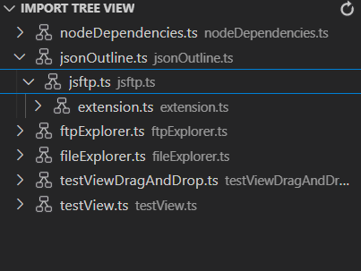

# import-tree-view README

The Import Tree View extension is a tool for developers that displays the hierarchical tree representation of all imported files in a codebase. This extension allows developers to easily visualize the dependencies and relationships between different modules and files, making it easier to understand and navigate complex code. It can be used in various code editors and integrated development environments (IDEs) and it helps to keep track of all imports and dependencies in the codebase. Additionally, it can help identify and resolve import issues, such as circular dependencies and missing imports. Overall, this extension can improve code readability and maintainability, making it a valuable tool for developers.

## Features

Presently this extension is will work only for TypeScript Language. 

On Click it will trace to the desired File.

## Known Issues

Try to avoid writing a single import statement in multilines while using this extension.

## Release Notes

v.1.0.0 - Working for TypeScript Programming Language 

**Enjoy!**